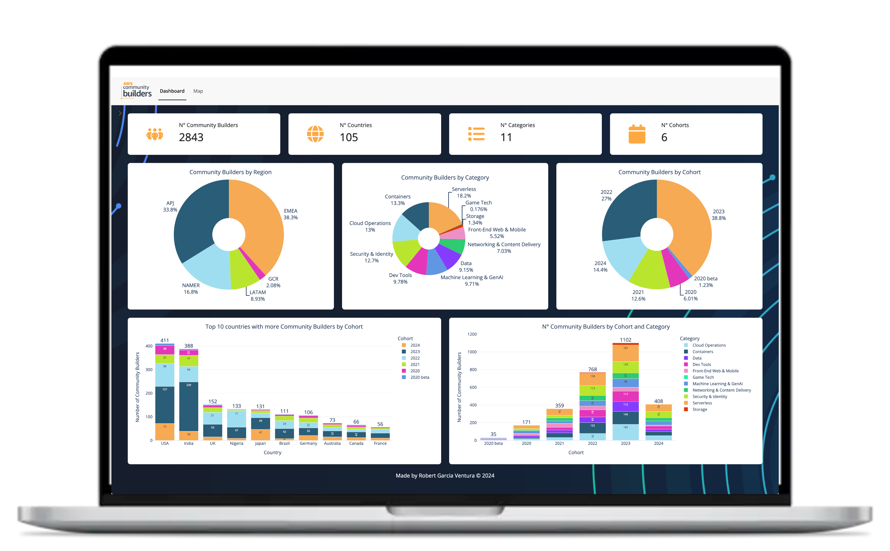
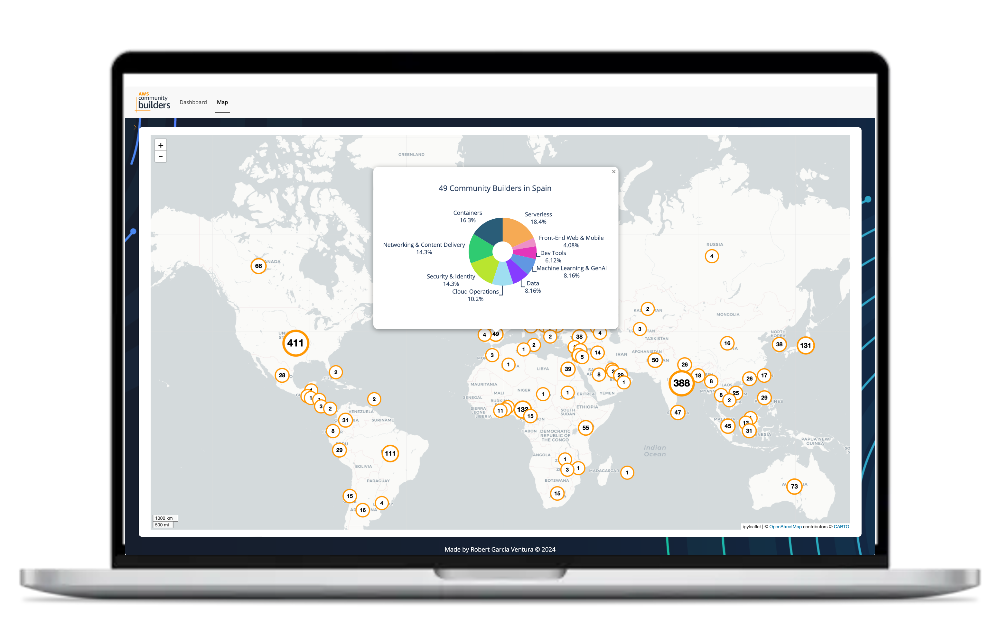

# Daten-Dashboard OSZ IMT

**Dashboardgestützte Analyse und Prognose von Energiedaten**

Ein interaktives Dashboard zur Visualisierung und Analyse von Daten, entwickelt als Schulprojekt am OSZ Informationstechnik und Medizintechnik (OSZ IMT).

## Projektübersicht

Dieses Projekt verwendet Python Shiny und Plotly, um ein interaktives Dashboard zu erstellen, das statistische Auswertungen visualisiert.

### Funktionen

- **Interaktive Weltkarte**: Visualisierung von Datenpunkten nach Ländern mit Popup-Diagrammen
- **Statistische Übersicht**: Anzeige von Kennzahlen (Anzahl Einträge, Länder, Kategorien, Kohorten)
- **Datenvisualisierung**: Pie-Charts und Balkendiagramme nach:
  - Region
  - Kategorie
  - Kohorte (Jahrgang)
  - Top 10 Länder
- **Dark/Light Mode**: Umschaltbare Farbthemen
- **Anpassbare Farbpaletten**: Verschiedene Farbschemata für die Diagramme

### Screenshots





## Technologie-Stack

| Technologie | Version | Beschreibung |
|-------------|---------|--------------|
| Python | >= 3.8 | Programmiersprache |
| Shiny | 0.10.1 | Web-Framework für interaktive Dashboards |
| Plotly | 5.22.0 | Interaktive Diagramme |
| Pandas | 2.2.2 | Datenverarbeitung |
| ipyleaflet | 0.19.1 | Interaktive Karten |
| faicons | 0.2.2 | Font Awesome Icons |

## Schnellstart

```bash
# Repository klonen
git clone https://github.com/VGhvbWFzTWFnT21hcw/daten-dashboard-oszimt.git
cd daten-dashboard-oszimt

# Virtuelle Umgebung erstellen und aktivieren
python -m venv venv
venv\Scripts\activate  # Windows
# source venv/bin/activate  # Linux/macOS

# Abhängigkeiten installieren
pip install -r dashboard-app/dashboard/requirements.txt

# Dashboard starten
cd dashboard-app/dashboard
shiny run app.py
```

Das Dashboard ist dann unter `http://127.0.0.1:8000` erreichbar.

## Dokumentation

- [Installationsanleitung](INSTALLATION.md) - Detaillierte Anweisungen zur Installation

## Projektstruktur

```
daten-dashboard-oszimt/
├── README.md                    # Diese Datei
├── INSTALLATION.md              # Installationsanleitung
├── LICENSE                      # MIT-Lizenz
└── dashboard-app/               # Haupt-Dashboard-Anwendung
    ├── dashboard/
    │   ├── app.py               # Hauptanwendung
    │   ├── plotly_streaming.py  # Plotly-Hilfsfunktionen
    │   ├── requirements.txt     # Python-Abhängigkeiten
    │   ├── data/                # CSV-Datendateien
    │   └── static/              # Statische Assets (Bilder)
    ├── src/                     # Hilfsskripte
    └── docs/                    # Dokumentation und Screenshots
```

## Hinweise zur Nutzung

- Für die beste Darstellung wird ein großer Bildschirm empfohlen
- Bei 80% Zoom erhält man eine gute Übersicht aller Grafiken
- Die Karte lädt in Chrome schneller als in Safari
- Beim ersten Start werden alle Dateien heruntergeladen

## Lizenz

Dieses Projekt steht unter der MIT-Lizenz - siehe [LICENSE](LICENSE) für Details.

---

*Entwickelt als Schulprojekt am OSZ IMT Berlin*
